# Baking Buddy Frontend

### 레시피를 공유하고 추천하는 웹 애플리케이션

## 개요

Baking Buddy는 사용자가 레시피를 공유하고, 다양한 레시피를 검색 및 추천받을 수 있는 웹 애플리케이션입니다. 사용자는 관심 있는 에디터를 팔로우하여 개인화된 피드를 통해 레시피를 확인하고, 검색 기능을 통해 원하는 레시피를 쉽게 찾을 수 있습니다. 또한, 특정 키워드에 따라 상품 및 레시피 추천 기능을 제공합니다.

## 주요 기능

- **피드**: 팔로우한 에디터의 최신 레시피를 피드에서 확인할 수 있습니다.
- **추천 시스템**: 사용자의 검색 및 클릭 행동에 따라 관련 상품 및 레시피를 추천합니다.
- **검색 기능**: 요리 이름, 재료, 태그 등을 기준으로 레시피를 검색할 수 있습니다.
- **자동 완성 기능**: 검색창에서 입력할 때 추천 검색어와 관련 이미지를 자동으로 보여줍니다.
- **레시피 상세 보기**: 레시피의 세부 정보(재료, 조리법, 태그 등)를 확인할 수 있습니다.
- **리뷰 및 좋아요 기능**: 레시피에 리뷰를 남기고, 좋아요를 눌러 다른 사용자와 공유할 수 있습니다.
- **알림 기능**: 새로운 팔로워나 새로운 레시피가 등록되었을 때 실시간 알림을 받을 수 있습니다.

## 기술 스택


## 설치 방법


### 설치 단계


## 화면
### 검색창
- 돋보기 아이콘을 눌렀을 때 뜨는 모달 창
- 요리 이름, 재료, 태그로 검색 가능
- 좌측에는 사용자가 최근 검색 한 최근 검색어 최대 10개
- 우측에는 시간 배치로 가장 많이 검색된 인기 검색어 10개

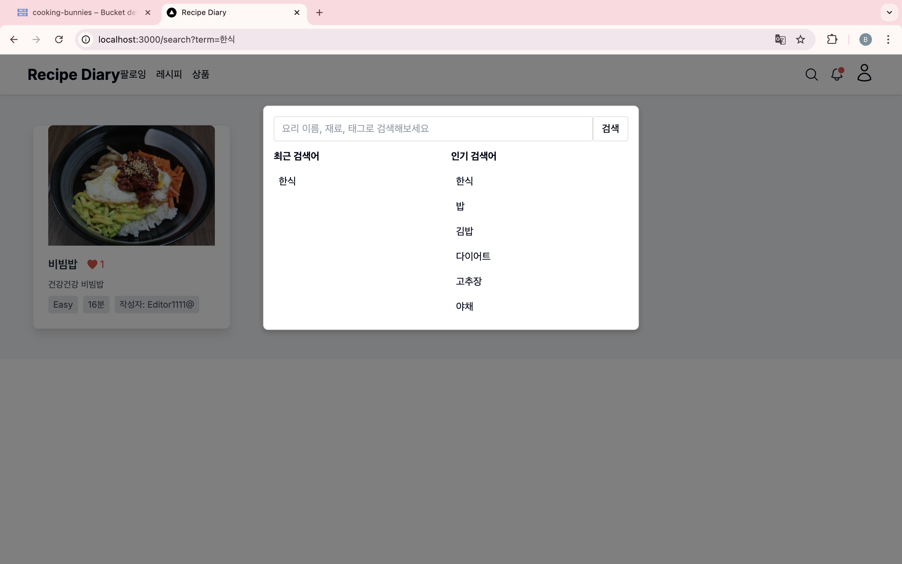
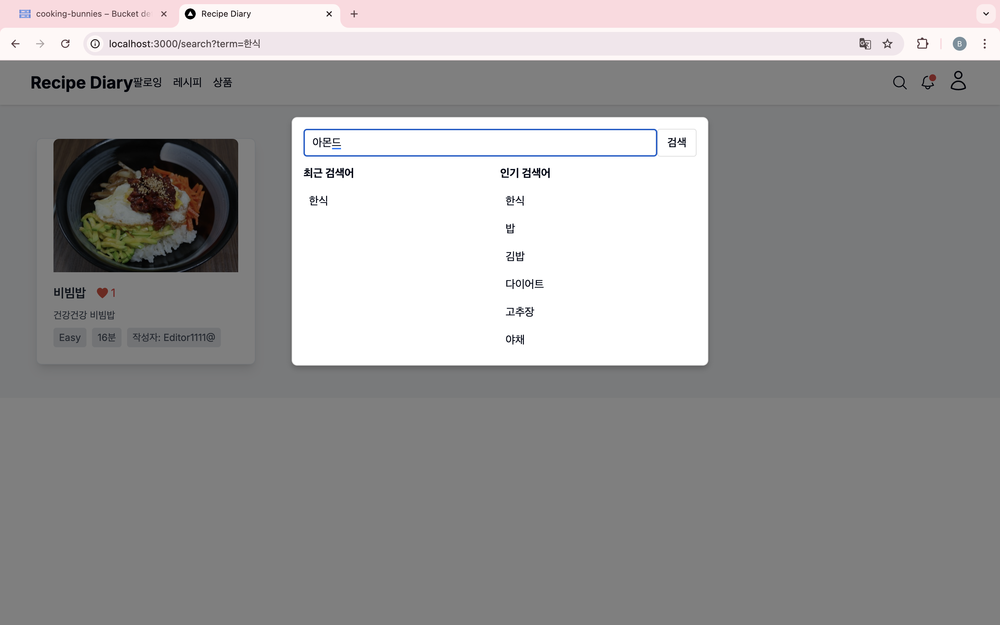

### 리뷰
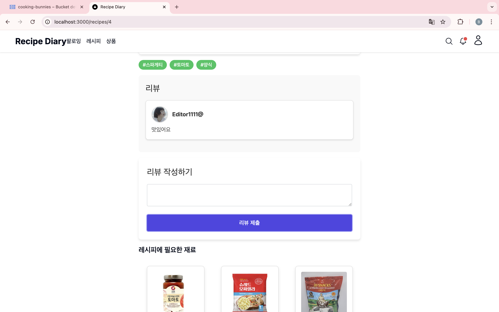

### 레시피 상세 화면
- 대표 이미지, 작성자, 좋아요 수, 소요시간, 난이도 등 정보
- 기준 인분에 따른 재료 조회
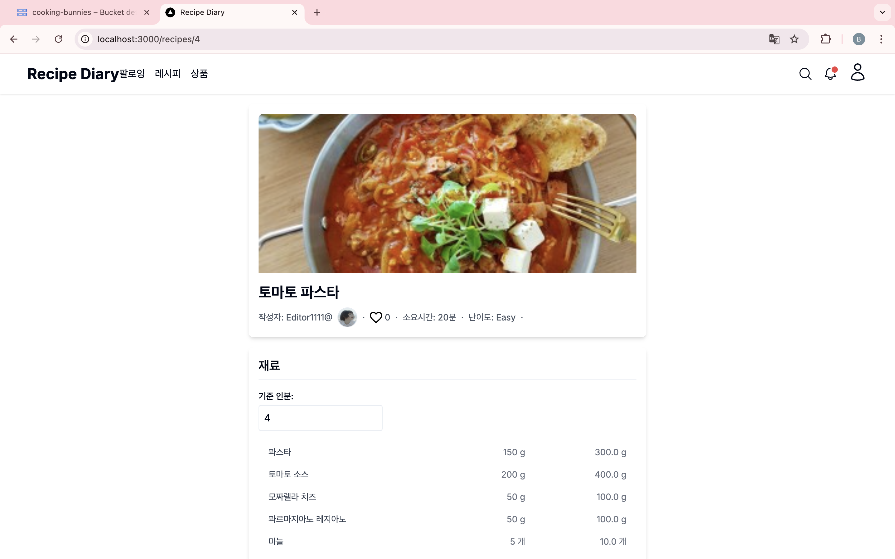
### 레시피에 필요한 재료 
- 네이버 쇼핑 API 활용
- 레시피 상세화면 하단에 위치
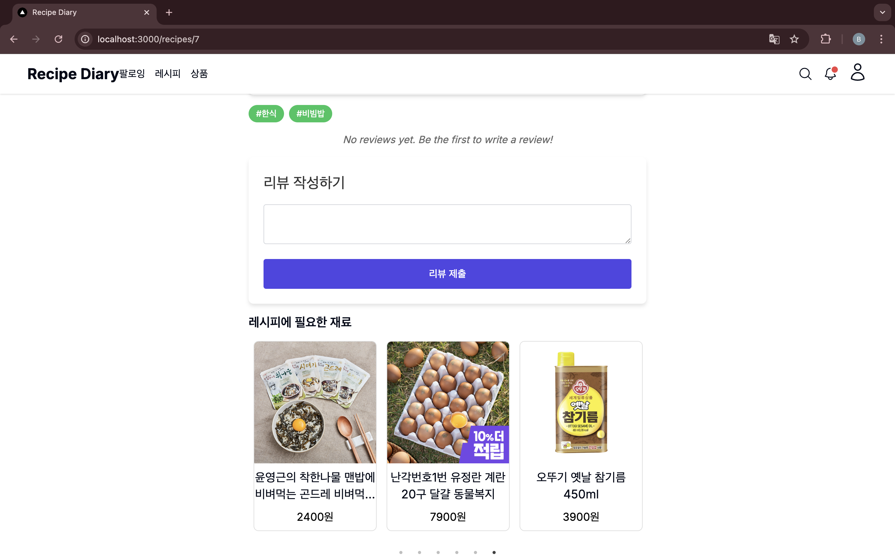
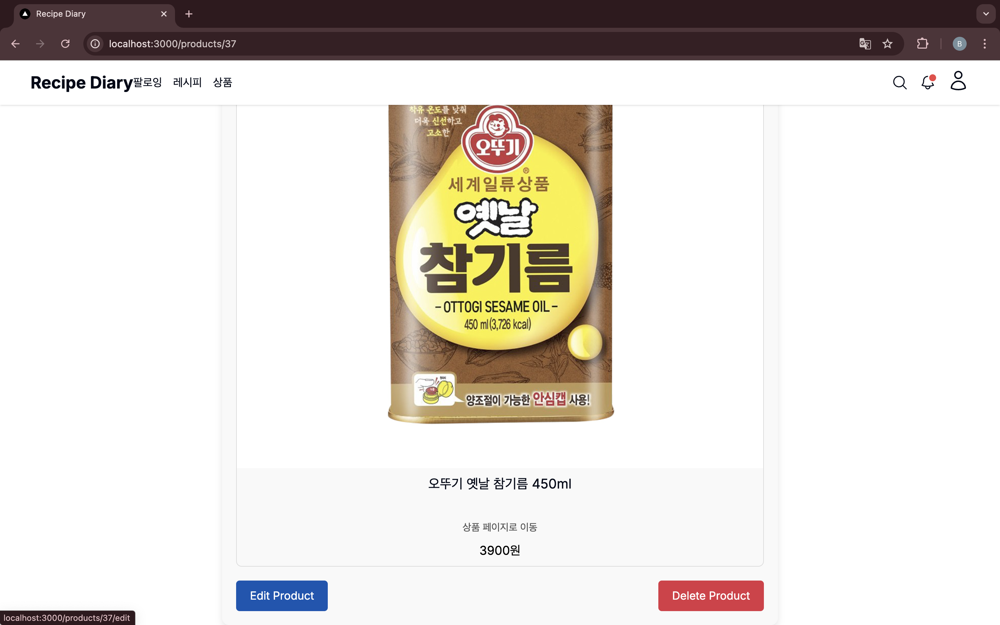

- 상품 페이지로 이동 클릭 시 네이버 쇼핑으로 이동

### 알림창
- 우측 상단 새로운 알림이 있으면 빨간 점으로 표시
- '알림' 헤더 혹은 모든 알림 보기를 누르면 알람 페이지로 이동
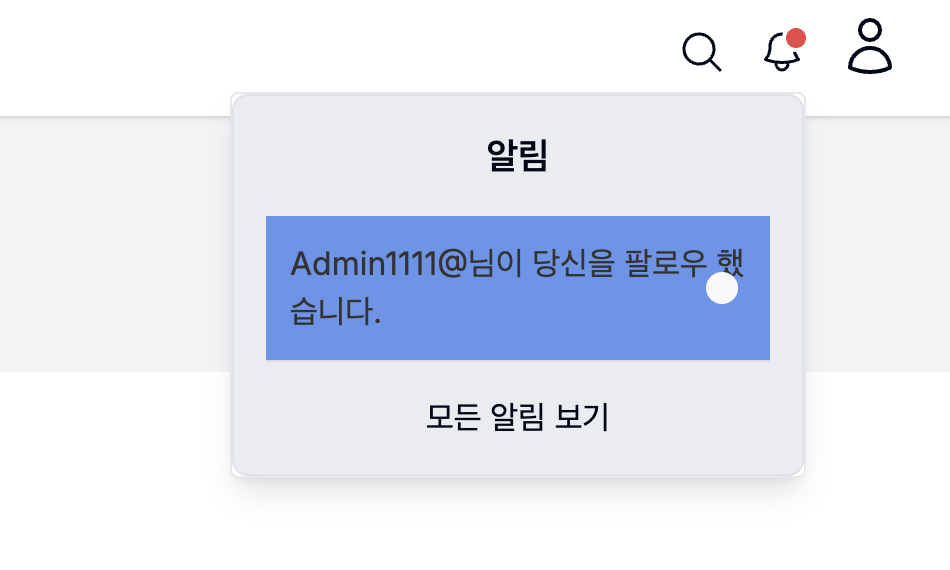

### 에디터 소개 페이지
- 에디터 소개 조회, 팔로우 기능
- 디렉토리 별 레시피 조회 가능

### 내 레시피
- 내 레시피를 조회
- 디렉토리 이름 클릭 시 토글로 여닫을 수 있음
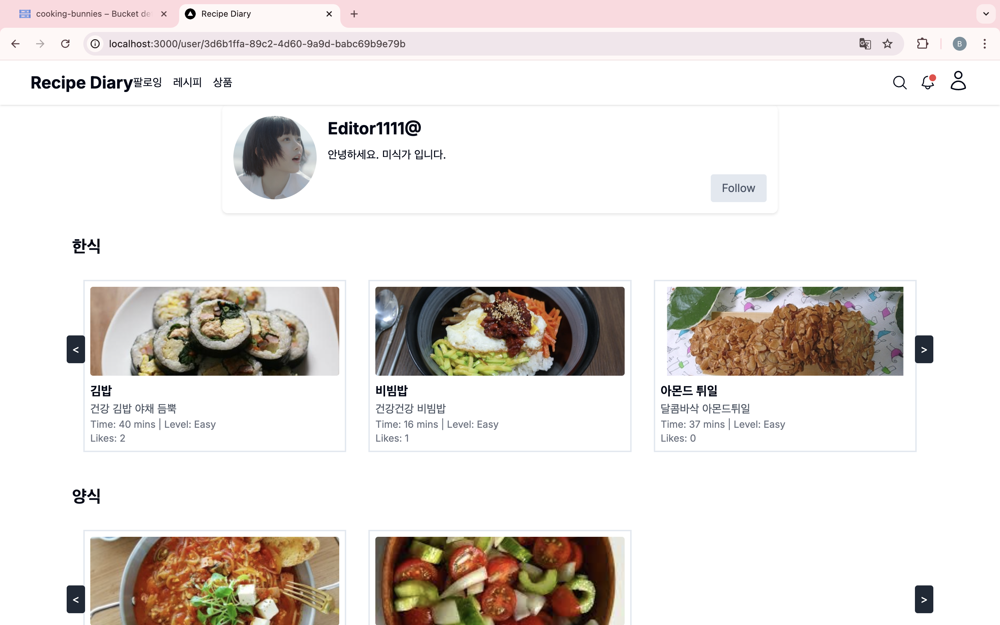
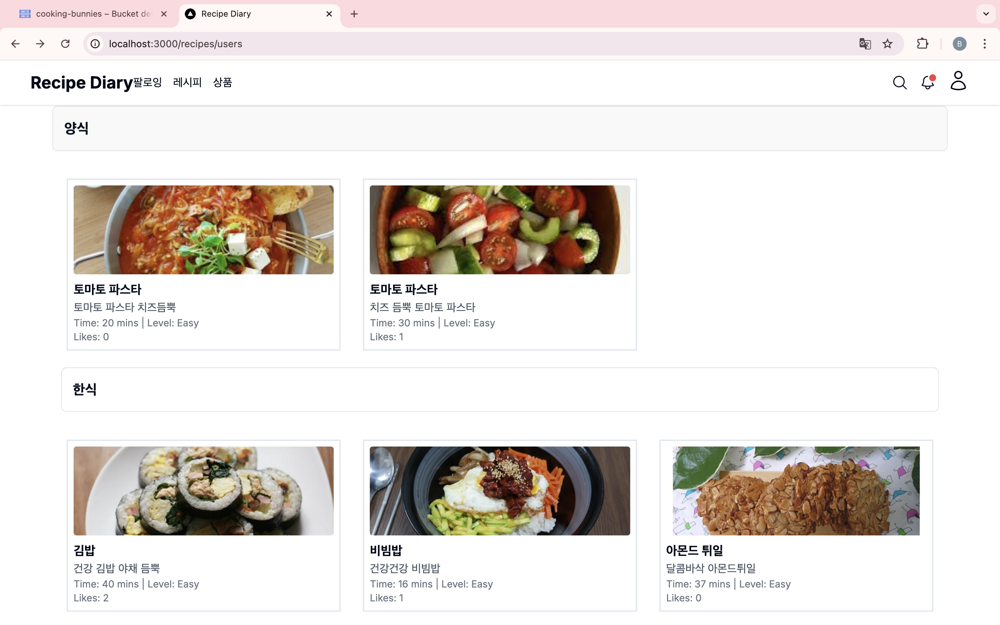

### 마이페이지
- 이미지 변경 기능
- 자기소개 수정 기능
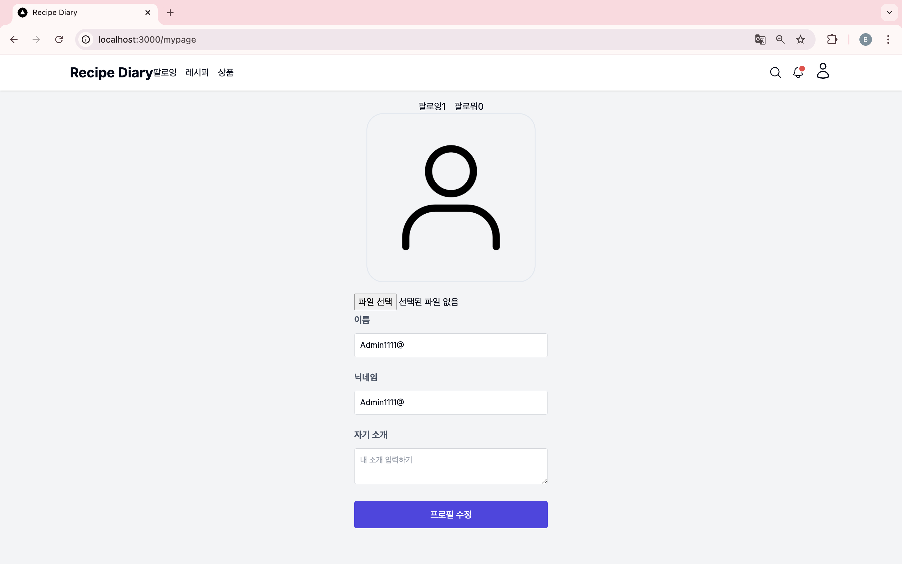
- 팔로잉, 팔로워 조회
  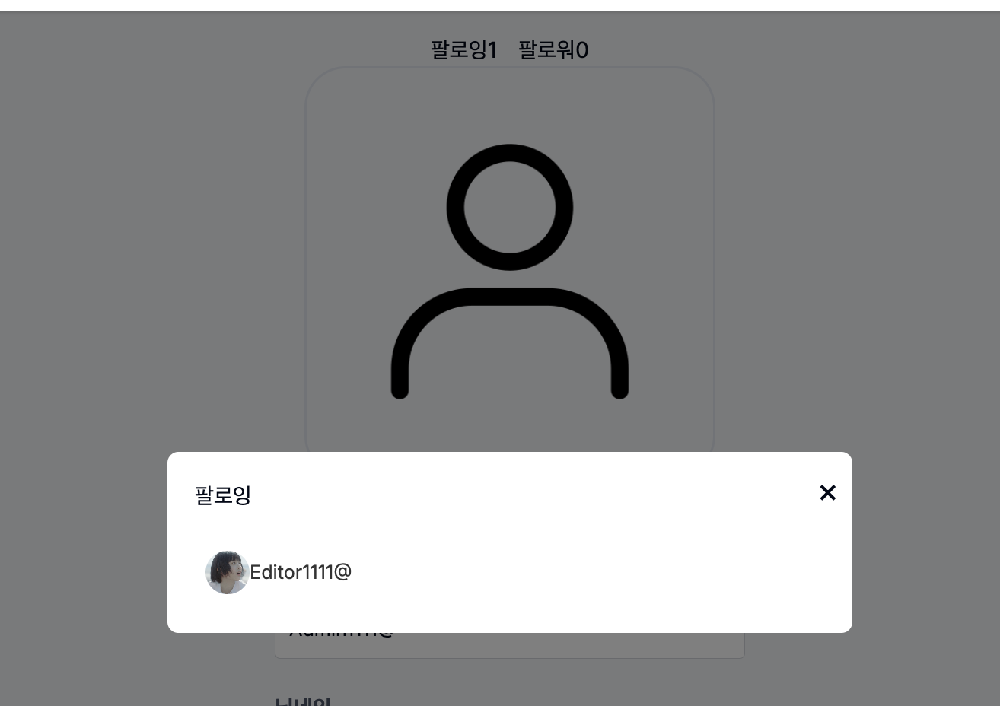


1. 저장소를 클론합니다:
   ```bash
   git clone https://github.com/
  ```

